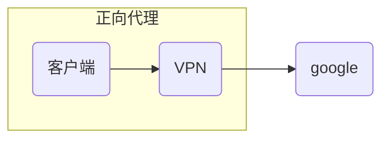
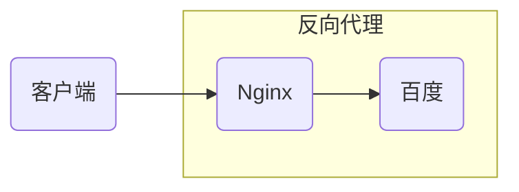

[toc]

## 什么是Nginx

> Nginx是一款[轻量级](https://link.zhihu.com/?target=https%3A//baike.baidu.com/item/%E8%BD%BB%E9%87%8F%E7%BA%A7/10002835)的[Web](https://link.zhihu.com/?target=https%3A//baike.baidu.com/item/Web/150564) 服务器/[反向代理](https://link.zhihu.com/?target=https%3A//baike.baidu.com/item/%E5%8F%8D%E5%90%91%E4%BB%A3%E7%90%86/7793488)服务器及[电子邮件](https://link.zhihu.com/?target=https%3A//baike.baidu.com/item/%E7%94%B5%E5%AD%90%E9%82%AE%E4%BB%B6/111106)（IMAP/POP3）代理服务器，在BSD-like 协议下发行。其特点是占有内存少，[并发](https://link.zhihu.com/?target=https%3A//baike.baidu.com/item/%E5%B9%B6%E5%8F%91/11024806)能力强，事实上nginx的并发能力确实在同类型的网页服务器中表现较好

## 正向代理和反向代理区别

> 正向代理：代理的是客户端，比如VPN
>
> 反向代理：代理的是服务端，比如Nginx等

### 正向代理

> 正向代理：客户端通过VPN访问google，谷歌获取的IP地址其实是VPN的IP地址，并不是客户端本身的IP地址，因为政策原因大陆用户不允许直接访问google（国外可以直接访问），在使用VPN后，google获取的IP地址是VPN的，如果VPN是香港获或其他地区的IP，所以可以通过VPN访问google

### 反向代理

> 反向代理：反向代理服务器通常有两种模型，它可以作为内容服务器的替身，也可以作为内容服务器集群的负载均衡器。前者一般是展示前端页面，后者则是为了提升网络访问效率，使用代理服务器还可以在一定程度上可以提升服务的安全性

## 为什么选择Nginx

> Nginx相对于其他反向代理服务器具有跨平台部署方便，体积小，资源消耗低，稳定性高，静态文件处理性能高等特点
