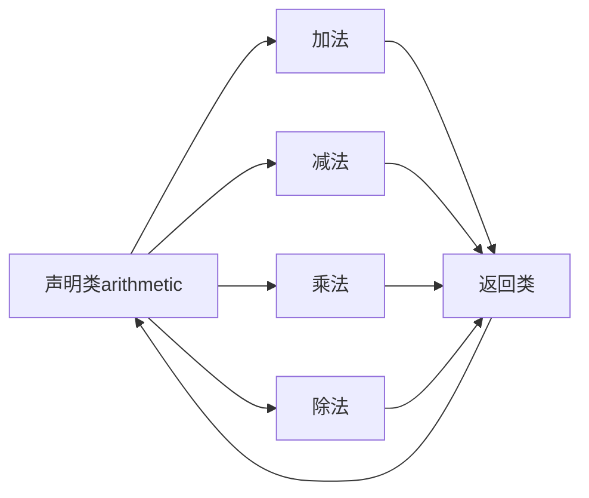

> 链式函数调用是指连续调用一系列函数，并将结果作为下一个函数的输入，依次进行

## 栗子

```python
# encoding:utf8

# 利用类实现链式函数调用
class arithmetic():
    def __init__(self):
        # 初始化值
        self.value = 0

    # 加法
    def add(self,num):
        self.value += num
        return self

    # 减法
    def sub(self,num):
        self.value -= num
        return self

    # 乘法
    def mul(self,num):
        self.value *= num
        return self

    # 除法
    def div(self,num):
        self.value /= num
        return self

# 实例化
number = arithmetic()
print(number.add(1).sub(2).mul(3).div(4).value)
# 结果
>>> -0.75

```

## 重点

每个链式函数的返回值都是类本身，有了这个条件它才可以在每调用一个链式函数后还可以调用其他一系列链式函数



